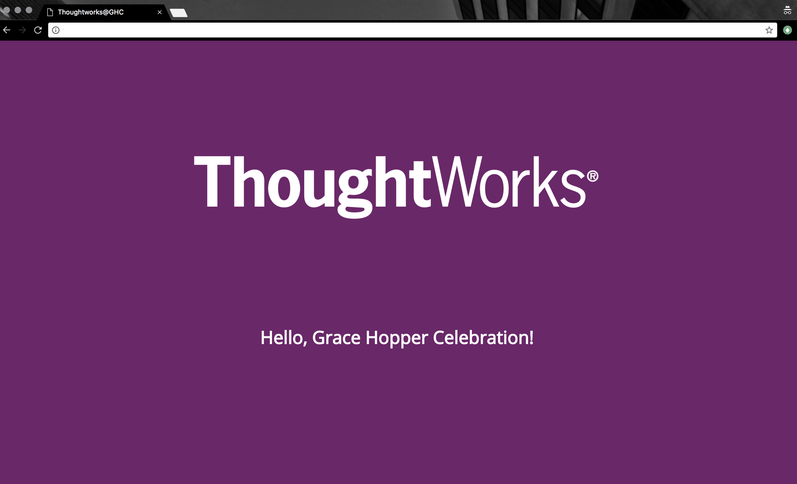

# Thoughtworks Grace Hopper Celebration: Infrastructure-as-Code
Exercise for Infrastructure-as-Code using Docker.

## About
This is an exercise to demonstrate how one can use Docker containers
to host a simple application and roll out a new image each time you want
to make updates to the application.

## Description
You've got a static web page you want served by a web server
that should look like the following:



However, you want to be able to:
* Give it to your friend to run on their laptop.
* Run it on a public cloud provider.

This is where container technologies like Docker are useful!
You can bake in all of your dependencies so no need to run
installation commands on your terminal and be able to package
and distribute it to your friends and servers.

## Setup and Overview
1. If you are setting this up on your own laptop, see the `Dependencies to Install` section, below.
1. Take a look at the directory structure of the repo:
    * `src` - Source files for the application to be deployed to a container
    * `profiles`- Container and application infrastructure tests
    * `answers-no-peeking`- makefile and Dockerfile with the answers to this exercise (no peeking!)

## Getting Started and Clues!
1. There are two sets of tests under the `profiles` directory.
    * The `container` tests check to make sure the application container
      has started.
    * The `hello-ghc` tests check that dependencies are installed and the
      application content is loaded into the container.
It will tell you how to run everything.
1. First, run the tests. See which ones pass and fix the ones that fail!
   ```
   $ make test
   ```
   *Hint: You might need to find a command to start the container for
   the first test to pass.*

You might find these resources helpful:
* [Dockerfile Commands](https://docs.docker.com/engine/reference/builder/)

## Dependencies to Install
You will need to install:
* [Docker](https://docs.docker.com/install/)
* [Ruby](https://www.ruby-lang.org/en/documentation/installation/)
* Ruby Package Dependencies (`bundle install`)
